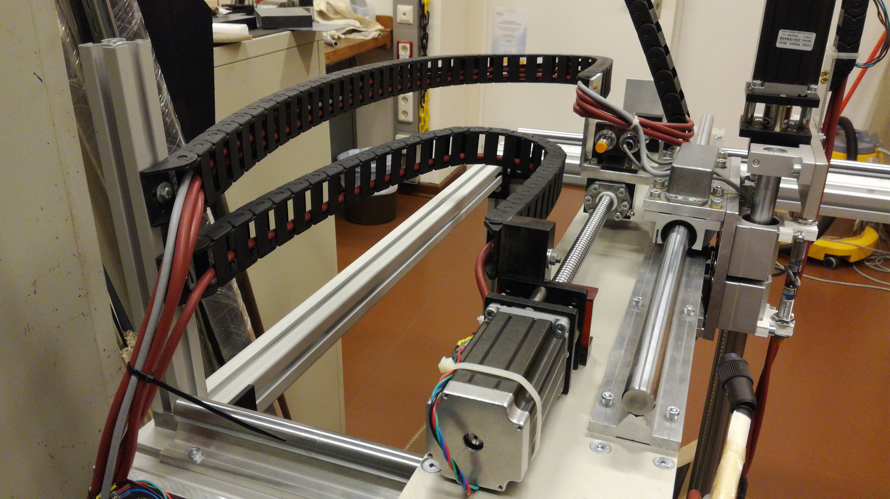

[Modular aluminium bar]: Parts.yaml#AluminumFrame_40x40x250
[Angles, 40x80]: Parts.yaml#Angle_40x80
[Slot nuts, M8]: Parts.yaml#SlotNut_M8
[M8x18 screws]: Parts.yaml#M8x18Screw
[Slot nuts, M5]: Parts.yaml#SlotNut_M5
[M5x20 screws]: Parts.yaml#M5x20Screw
[Cable chain holder Y]: Parts.yaml#CableChainHolderY
[Cable chain]: Parts.yaml#CableChain

# COSI-measure: Wiring

{{BOM}}

Now that the mechanical frame and electronic elements are ready, we can assemble them and wire the different parts of the system.

## Cable chains

Slide two [Slot nuts, M8]{Qty: 2} into the upper rail of the top left X-axis bar. The rails should be clear, put one nut in each rail.

[take picture]

Secure a [Angles, 40x80]{Qty: 1} to these slide nuts using two [M8x18 screws]{Qty:2}.

[take picture]

Slide two additional [Slot nuts, M8]{Qty: 2} into the rail of the [Modular aluminium bar]{Qty: 1} and secure it to the angle using two [M8x18 screws]{Qty:2}.

[take picture]

Slide two more [Slot nuts, M8]{Qty: 2} into the rail of the bar that faces the inside of the frame. Then attach one [Cable chain]{Qty:2} to each of these nuts using a [M5x20 screws]{Qty:2}.

[picture]

Attach the [Cable chain holder Y] to the Y-stepper motor holder using (TO BE DETERMINED).

[picture]

Now attach the lower cable chain to the [Y cable chain holder] using (SCREWS TO BE DETERMINED).

[picture]

Attach the [Cable chain holder Z1] to the Aluminium plate 5. Y-stepper motor holder using the .

[picture]

Secure the [Cable chain holder Z2Y] to the Aluminium plate 5, and the [Cable chain holder Z2Z] to the Aluminium plate 8 using {SCREWS TO BE DETERMINED). Then secure the third [Cable chain]{Qty:1} to these holders.

[picture]

## Stepper motors
Run the cables....
Connect the cables to ....

## Endstop system

## Optional: monitor

## Mains supply